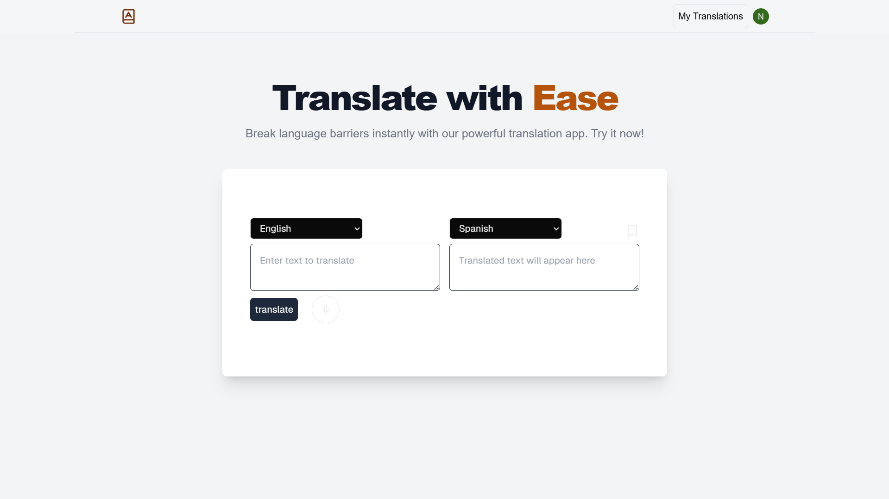

# AI Translator



AI Translator is an advanced AI-powered application designed to deliver fast, accurate, and context-aware translations. It supports multiple languages, includes features like translation saving, user authentication, and voice recording. Built with cutting-edge technologies, the app ensures a seamless and efficient user experience.

## Features

- **Multiple Language Support**: Translate text into various languages with high accuracy.
- **Save Translations**: Save and access your translations anytime.
- **User Authentication**: Secure login and signup functionality using ClerkAuth.
- **Voice Recorder**: Record voice input for translations.
- **AI-Powered**: Leverages Gemini AI for accurate and context-aware translations.

## Tech Stack

- **Frontend**: [Next.js](https://nextjs.org/), [React.js](https://react.dev/), [Tailwind CSS](https://tailwindcss.com/)
- **Authentication**: [ClerkAuth](https://clerk.dev/)
- **AI Engine**: Gemini AI
- **Database**: [Neon DB](https://neon.tech/)

## Installation and Setup

Follow these steps to set up and run the project locally:

1. **Clone the Repository**:
   ```bash
   git clone https://github.com/Ayan-Alam25/ai-translator.git
   cd ai-translator
   ```

2. **Install Dependencies**:
    ```bash
    npm install
    ```

3.  **Environment Variables**:
     Create a .env.local file in the root directory and add the following variables:
    ```bash
    GOOGLE_GENERATIVE_AI_API_KEY=
    DATABASE_URL=
    NEXT_PUBLIC_CLERK_PUBLISHABLE_KEY=
    CLERK_SECRET_KEY=
    ```

4. **Run the Development Server**:
    ```bash
    npm run dev
    ```
    The app will be available at http://localhost:3000.
   
## Usage

1. **Login/Signup**: 
   - Use ClerkAuth to log in or sign up to the app.
   
2. **Select Languages**: 
   - Choose the input and target languages for translation.

3. **Enter Text or Use Voice Recorder**: 
   - Type the text you want to translate or use the voice recorder to input speech.

4. **View Translation**: 
   - The app will display the translated text.

5. **Save Translations**: 
   - You can save your translations for future reference.

---

## Deployment

1. **Vercel Deployment**:  
   To deploy the app on Vercel, follow these steps:
   
   - Sign up or log in to [Vercel](https://vercel.com/).
   - Click on "New Project" and select this GitHub repository.
   - Follow the instructions to deploy.
   
2. **Manual Deployment**:  
   If you'd like to deploy the app manually on a different platform, follow these steps:
   
   - Push the code to your desired hosting provider.
   - Ensure the environment variables like ClerkAuth and Neon DB URL are set properly in the hosting platform's environment settings.